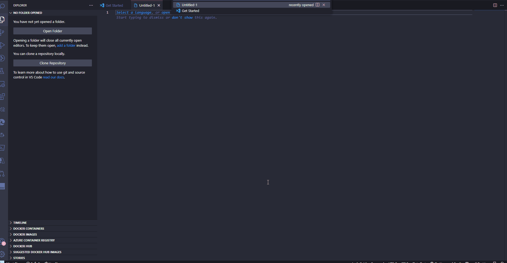

# Eskom Extension README

"Eskom Loadshedding Notifier: This VSCode extension uses the [EskomSePush API](https://eskomsepush.gumroad.com/l/api) to retrieve the next loadshedding schedule for your area and sends a notification 15 minutes before the scheduled slot. Never be caught off guard by power outages again!" - thanks ChatGPT

You will need to subscribe to the EskomSePush (Free for 50 requests per day extension polls every 60mins) and find your area code(eg. capetown-7-greenpoint)

You can use the following command replacing the area and token:
`curl --location --request GET 'https://developer.sepush.co.za/business/2.0/areas_search?text=forways' --header 'token: xxxxxxxx-xxxxxxxx-xxxxxxxx-xxxxxxxx'`

## Features

## Requirements

- EskomSePush API key (Free)
- EskomSePush Area code

## Extension Settings

This extension contributes the following settings:

- `eskom.token`: EskomSePush API key.
- `eskom.area`: EskomSePush Area code.

## Known Issues

## Release Notes

### 1.0.0

Initial release of Eskom loadshedding notifier
Adds a 15 minute warning
Provides a command 'Next Loadshedding' that gives information on the end time of the current loadshedding slot or the start time of the next slot.

## Contributing

We welcome and appreciate any contributions to the Eskom Loadshedding Notifier extension. Whether you are a beginner or an experienced developer, there is always a way for you to contribute. Here are a few ways you can help:

**Reporting Bugs:** If you encounter any bugs while using the extension, please open an issue on GitHub so that we can fix them.

**Suggesting Features:** If you have an idea for a new feature that would improve the extension, please open an issue on GitHub to share your suggestions.

**Fixing Bugs and Implementing Features:** If you would like to contribute by fixing bugs or implementing new features, please fork the repository, make the changes, and submit a pull request.

**Documentation:** If you find any inaccuracies or missing information in the documentation, please feel free to update it and submit a pull request.

## Development

Before you begin, please ensure that you have the following installed on your machine:

- Visual Studio Code
- Node.js

  To get started with development, please follow these steps:

1. Fork the repository
2. Clone the repository to your machine
3. Open the repository in Visual Studio Code
4. Run the command npm install to install all dependencies
5. Make your changes
6. Test your changes by running the extension in the VS Code Extension Development Host
7. Submit a pull request

Please make sure to follow the VS Code extension guidelines when developing the extension. [Extension Guidelines](https://code.visualstudio.com/api/references/extension-guidelines)

Thanks for considering contributing to the Eskom Loadshedding Notifier extension. We look forward to working with you!

You can find the repository at https://github.com/bryn-hill/Eskom-vscode-extension

## Disclaimer

The Eskom Loadshedding Notifier extension is a third-party tool and is not endorsed by, affiliated with, or supported by Eskom or EskomSePush. The extension uses the EskomSePush development API to provide load shedding schedule updates, but the accuracy of the information cannot be guaranteed.

Eskom and EskomSePush take no responsibility for any errors or inaccuracies in the load shedding schedule provided by the extension. Users should consult the official Eskom website for the most up-to-date and accurate load shedding schedule.

The developers of the Eskom Loadshedding Notifier extension are not responsible for any damages or losses that may occur as a result of using the extension. Use of the extension is at your own risk.
